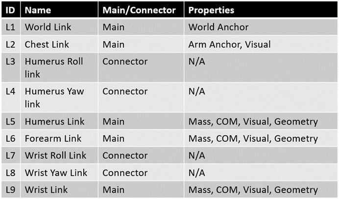

# Open-Source-Kinematic-Analysis-Toolkit
An open-source toolkit has been developed using an anthropomorphic arm model. It allows any data set containing joint angles over time to be implemented to visualise motion for kinematic analysis.

Welcome to my MRes dissertation project.
This repository contains the following:

-Simplified Arm model of the human arm

-Code for simulation using Pybullet physics engine

-Link to Participant-generated joint angles: https://github.com/MiaH-kin/UE_ADLdatabase/tree/master

-Packages used in conda environment to run all together

**Instructions for Setup**

1.	Use Anaconda to create a virtual environment 
2.	Download “environment.yml” to local machine
3.	Run the following line in anaconda prompt:
a.	conda env create --file /path/to/environment.yml
i.	Replacing “/path/to/environment.yml” with the path to the file
4.	Activate the environment using the following command:
a.	Conda active sim_env
5.	Verify packages by comparing results produced from this line with the txt file “requirements.txt”:
a.	Conda list
6.	Lines 421-428 contain the paths to the participant files; please change them accordingly to where they are currently installed on your machine 
a.	"*where you saved project too*/Dissertation_Code/Joint Angles/UE_ADLdatabase-master/ADL004/ADL004FR1angles.csv"
7.	By default, the model is performing one of the participants reaching forward motion visualised by the GUI that pops up
8.	Additionally, all kinematic information will be presented once the simulation has run its course, but to see the next, the first will need to be closed, not the GUI.
a.	Please note that the kinematic workspace will take time to run 
9.	If you wish to change which participant data is being used by the model, you will find this nested in the function real_data()
a.	Look for the current data and comment/uncomment which one you would like
b.	Please note that the file path will need to be verified 
10.	If you wish to change the movement being performed for it to be manual movement, you will need to change two things:
a.	The first is in the function Bicep_curl; the majority of the code will need to be uncommented so that you can see which block of code performs which movement
b.	The second is in the main() function. You will need to comment out the real data function and uncomment the line that begins with “joint_positions_timeline….” I have left a comment below which line
c.	” 
11.	In the Anaconda prompt terminal, run the following command
a.	Python testing.py
b.	This will run the simulation

### The motions of the human arm:

### Human shoulder movements

Note that Lateral rotation is external rotation, with medial being internal rotation 

### Human elbow movements

### Human Wrist and forearm movements

### 7 DOF kinematic chain:

### 7 DOF kinematic chain link properties:

### 7 DOF kinematic chain revolute joint descriptions:

### Calculations used for lengths and weights:
173.3 x 17.25/173.3 = 29.89cm 	-Upper arm Length  
67.49kg x 3.075/67.49 = 2.07kg	-Upper arm weight  

173.3 x 15.85/173.3 = 27.46cm 	-Forearm Length  
67.49kg x 1.72/67.49 = 1.16kg		-Forearm weight  

According to reference (26), the average hand weight was 400g. 
According to reference (25), the average hand length was 18.105cm. 

### Table One: Value Key for Movements for each Joint 

| Joint     | Movement              | Positive | Negative |
|-----------|------------------------|----------|---------|
| Shoulder  | Flexion                |          |   YES   |
| Shoulder  | Extension              | YES      |         |
| Shoulder  | Internal Rotation      | YES      |         |
| Shoulder  | External Rotation      |          |   YES   |
| Shoulder  | Abduction              | YES      |         |
| Shoulder  | Adduction              |          |   YES   |
| Elbow     | Flexion                |          |   YES   |
| Elbow     | Extension              | YES      |         |
| Wrist     | Pronation              | YES      |         |
| Wrist     | Supination             |          |   YES   |
| Wrist     | Flexion                | YES      |         |
| Wrist     | Extension              |          |   YES   |
| Wrist     | Ulnar Deviation        |          |   YES   |
| Wrist     | Radial Deviation       | YES      |         |

### Kinematic Workspace with increased resolution: 

Sample rate at 10
J1 = 10
J2 = 10
J3 = 10
J4 = 10
J5 = 10
J6 = 10
J7 = 10
10 * 10 * 10 * 10 * 10 * 10 * 10 

This is 10,000,000 total points in space plotted

**Note that in the trajectory plots, 0.01 equals 1cm in the real world.**

### Abduction Model and Trajectory

Note that images of the GUI have an X, Y, and Z line going from the coordinates 0,0, 0 (red ball location), where the red line is X, blue is Z, and Y is green. 

### Elbow Flexion Model and Trajectory

Note that images of the GUI have an X, Y, and Z line going from the coordinates 0,0, 0 (red ball location), where the red line is X, blue is Z, and Y is green. 

### External Rotation Model and Trajectory

Note that images of the GUI have an X, Y, and Z line going from the coordinates 0,0, 0 (red ball location), where the red line is X, blue is Z, and Y is green. 

### Flexion Model and Trajectory

Note that images of the GUI have an X, Y, and Z line going from the coordinates 0,0, 0 (red ball location), where the red line is X, blue is Z, and Y is green. 

### Hip Extension Model and Trajectory

Note that images of the GUI have an X, Y, and Z line going from the coordinates 0,0, 0 (red ball location), where the red line is X, blue is Z, and Y is green. 

### Supination Model and Trajectory

Note that images of the GUI have an X, Y, and Z line going from the coordinates 0,0, 0 (red ball location), where the red line is X, blue is Z, and Y is green. 

### Ulnar Deviation Model and Trajectory

Note that images of the GUI have an X, Y, and Z line going from the coordinates 0,0, 0 (red ball location), where the red line is X, blue is Z, and Y is green. 

The accuracy is calculated by taking the difference between the raw value and the model value, dividing it by the raw value, and then multiplying the result by 100%.

### Participant 4 model joint angle change vs raw joint angle change
 Raw Angular change at end ^

 Model Angular change at end ^

### Participant 4 angular change  Values  

| Joint    | Raw | Model |
|----------|------|-------|
| J1       | 37.74|  37.78|
| J2       | 0.24 | 0.42  |
| J3       | 15.05| 14.08 |
| J4       | 70.77|  70.46|
| J5       | 1    | 	1.01|
| J6       | 6.72 |  6.77 |
| J7       | 9.87 |  9.94 |

J1: 99.89%
J2: 25% 
J3: 93.54%
J4: 99.56%
J5: 99%
J6: 99.26%
J7: 99.29%
Total Accuracy: 87.93%

### Participant 10 models joint angle change vs raw joint angle change
 Raw Angular change at end ^

 Model Angular change at end ^

### Participant 10 angular change  Values
| Joint    | Raw | Model |
|----------|------|-------|
| J1       | 35.85|  35.83|
| J2       | 1.06 |  1.04 |
| J3       | 7.81 |  7.82 |
| J4       | 61.46|  64.38|
| J5       | 13.39|  13.27|
| J6       | 16.96|  16.83|
| J7       | 24.06|  23.71|

J1: 99.94%
J2: 98.11%
J3: 99.87%
J4: 95.25%
J5: 99.10%
J6: 99.23%
J7: 98.55%
Total Accuracy: 98.96%

